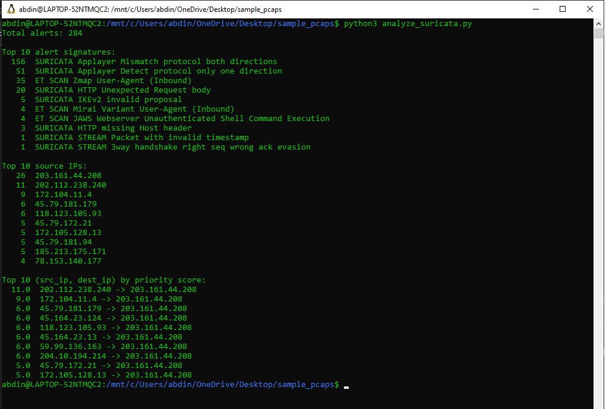
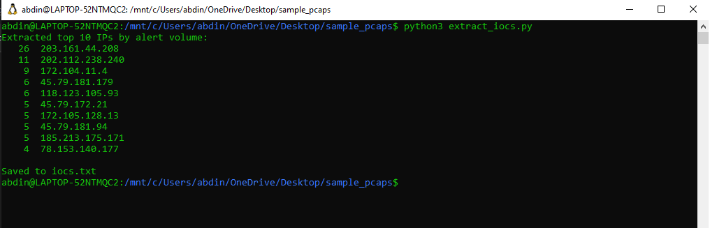
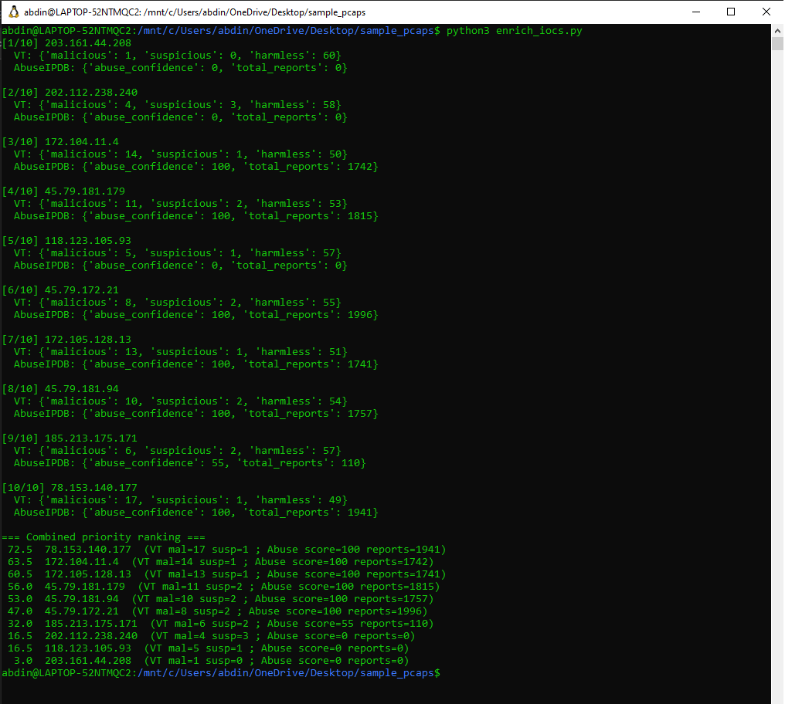

---

# **Suricata Alert Analysis and Threat-Intelligence Driven SOC Prioritization**

## **Background and Project Context**

Intrusion Detection Systems (IDS) such as Suricata, Zeek, and Microsoft Defender for Endpoint generate significant alert volume in modern enterprise environments. While IDS signatures provide valuable detection, analysts often face several operational challenges:

* High alert noise and repetitive signatures
* Lack of prioritization or scoring
* Limited context about whether an external IP is harmful
* Difficulty determining which attacker IPs require immediate investigation

During prior network-forensics work, it became clear that *raw Suricata alerts alone cannot support confident triage*. Additional enrichment is necessary to understand whether an IP is globally malicious, newly active, or historically associated with abuse.

To address this gap, this project integrates:

* Suricata alert parsing
* Automated IOC extraction
* VirusTotal + AbuseIPDB threat-intelligence enrichment
* A combined-score model for ranking attacker IPs
* Visual reporting for SOC workflows

This produces a practical, job-ready SOC tool that reduces noise, highlights the highest-risk external hosts, and demonstrates core analyst competencies.

---

## **Objective**

Develop a complete SOC triage workflow that:

1. Parses Suricata `eve.json` alerts generated from a PCAP.
2. Extracts attacker IOCs (IP addresses, alert counts, signatures).
3. Enriches each IOC using VirusTotal and AbuseIPDB.
4. Computes a combined priority score.
5. Generates analyst-ready tables and visualizations.

---

# **Methods**

The analysis follows a structured SOC workflow.

---

## **1. Suricata Log Analysis**

The PCAP was processed using Suricata in offline mode:

```
suricata -r <capture.pcap> -l suricata_output/
```

The resulting `eve.json` file was parsed to extract:

* Total alert volume
* Top signatures
* Top attacking source IPs
* High-volume (src,dst) flows

**Suricata Summary**



**Key Observations**

* Total alerts: **284**
* Activity primarily reflects external scanning behavior
* Notable signatures include:

  * AppLayer protocol mismatch
  * ZMap scanning
  * Malformed HTTP headers
  * SSH/IKev2 anomalies

This establishes the baseline threat landscape prior to enrichment.

---

## **2. IOC Extraction**

A custom Python script extracted the most active attacker IPs:

```
python3 extract_iocs.py
```

**Extracted IPs**



A sorted IOC list was generated and saved to `iocs.txt`.

---

## **3. Threat-Intelligence Enrichment**

Each IOC was enriched using the following sources:

### **VirusTotal (VT)**

* Count of malicious, suspicious, and harmless detections across malware engines

### **AbuseIPDB**

* Abuse confidence score (0–100)
* Total number of global abuse reports

Run command:

```
python3 enrich_iocs.py
```

**Enriched IOC Output**



---

## **4. Combined Risk Scoring**

The analysis pipeline computed a **combined score** for each IOC based on:

```
combined_score = VT_malicious + VT_suspicious + (Abuse_confidence / 2)
```

This places emphasis on VT and AbuseIPDB—strong indicators of real-world malicious activity.

### **Exact Combined-Score Ranking (from highest to lowest)**

(as produced by the enrichment script)

```
72.5   78.153.140.177   (VT 17 mal / 1 susp ; Abuse 100 , 1941 reports)
63.5   172.104.11.4     (VT 14 mal / 1 susp ; Abuse 100 , 1742 reports)
60.5   172.105.128.13   (VT 13 mal / 1 susp ; Abuse 100 , 1741 reports)
56.0   45.79.181.179    (VT 11 mal / 2 susp ; Abuse 100 , 1815 reports)
53.0   45.79.181.94     (VT 10 mal / 2 susp ; Abuse 100 , 1757 reports)
47.0   45.79.172.21     (VT 8  mal / 2 susp ; Abuse 100 , 1996 reports)
32.0   185.213.175.171  (VT 6  mal / 2 susp ; Abuse 55  , 110  reports)
16.5   202.112.238.240  (VT 4  mal / 3 susp ; Abuse 0   , 0    reports)
16.5   118.123.105.93   (VT 5  mal / 1 susp ; Abuse 0   , 0    reports)
3.0    203.161.44.208   (VT 1  mal / 0 susp ; Abuse 0   , 0    reports)
```

This ranking represents the **final true order of priority**.

---

## **5. Prioritized Threat-Intel Table**

| Priority | IP Address      | VT Malicious | VT Suspicious | VT Harmless | Abuse Confidence | Abuse Reports | Combined Score |
| -------- | --------------- | ------------ | ------------- | ----------- | ---------------- | ------------- | -------------- |
| **1**    | 78.153.140.177  | 17           | 1             | 49          | 100              | 1941          | **72.5**       |
| **2**    | 172.104.11.4    | 14           | 1             | 50          | 100              | 1742          | **63.5**       |
| **3**    | 172.105.128.13  | 13           | 1             | 51          | 100              | 1741          | **60.5**       |
| **4**    | 45.79.181.179   | 11           | 2             | 53          | 100              | 1815          | **56.0**       |
| **5**    | 45.79.181.94    | 10           | 2             | 54          | 100              | 1757          | **53.0**       |
| **6**    | 45.79.172.21    | 8            | 2             | 55          | 100              | 1996          | **47.0**       |
| **7**    | 185.213.175.171 | 6            | 2             | 57          | 55               | 110           | **32.0**       |
| **8**    | 202.112.238.240 | 4            | 3             | 58          | 0                | 0             | **16.5**       |
| **9**    | 118.123.105.93  | 5            | 1             | 57          | 0                | 0             | **16.5**       |
| **10**   | 203.161.44.208  | 1            | 0             | 60          | 0                | 0             | **3.0**        |

---

# **Findings**

* The highest-ranked IPs show extremely high AbuseIPDB scores and long abuse histories.
* VirusTotal detections indicate repeated malicious behavior across multiple engines.
* Suricata signatures confirm active scanning and malformed traffic.
* Combined scoring highlights the most dangerous attacker IPs requiring immediate investigation or blocking.

---

# **Evidence & Reproducibility**

**Included Files**

* [`logs/eve.json.zip`](suricata_output/eve.json.zip)
* [`extract_iocs.py`](extract_iocs.py)
* [`enrich_iocs.py`](enrich_iocs.py)

### **PCAP Source**

Dataset used for Suricata processing:
**Malware-Traffic-Analysis.net — “2024-07-23: Eight Days of Server Scans and Probes”**
[https://www.malware-traffic-analysis.net/2024/07/23/index.html](https://www.malware-traffic-analysis.net/2024/07/23/index.html)

---

# **Conclusion & Recommendations**

This project demonstrates a complete SOC-grade threat-analysis workflow:

* IDS alert parsing
* IOC extraction
* Threat-intelligence enrichment
* Automated risk scoring
* SOC-ready reporting

### Recommended SOC Actions

* Block the top malicious IPs at perimeter controls.
* Add enrichment-based logic to SIEM correlation rules.
* Enable automated enrichment pipelines for future Suricata events.
* Correlate IDS logs with EDR, firewall, and authentication telemetry.

This workflow can be extended into ongoing threat-hunting, detection engineering, and automated SOC playbooks.

---

**Author:** Abdinoor Ahmed

Suricata Log Analysis & SOC Alert Prioritization Lab

---

